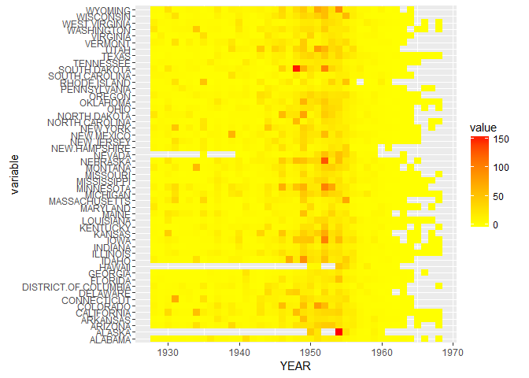

1928-1969間，小兒麻痺在美國各州的發生率變化
================

資料前處理
----------

``` r
#讀csv資料
polio<-read.csv("POLIO_Incidence.csv",stringsAsFactors=F)
head(polio)
```

    ##   YEAR WEEK ALABAMA ALASKA ARIZONA ARKANSAS CALIFORNIA COLORADO
    ## 1 1928    1       0      -       0        0       0.17     0.39
    ## 2 1928    2       0      -       0        0       0.15      0.2
    ## 3 1928    3    0.04      -       0        0       0.11        0
    ## 4 1928    4       0      -    0.24     0.11       0.07      0.2
    ## 5 1928    5       0      -    0.24        0       0.32        0
    ## 6 1928    6       0      -       0        0       0.22      0.1
    ##   CONNECTICUT DELAWARE DISTRICT.OF.COLUMBIA FLORIDA GEORGIA HAWAII IDAHO
    ## 1           0        0                    -       0    0.03      -     0
    ## 2           0        0                    -       0       0      -     0
    ## 3        0.06        0                    -       0       -      -     0
    ## 4        0.06        0                    0       0       0      -     0
    ## 5        0.13        0                    0       0       0      -     0
    ## 6           0        0                    0       0       0      -     -
    ##   ILLINOIS INDIANA IOWA KANSAS KENTUCKY LOUISIANA MAINE MARYLAND
    ## 1     0.03    0.03 0.08      0        0         0     0     0.06
    ## 2     0.01    0.03    -   0.22        0      0.05  0.13     0.06
    ## 3     0.03    0.03    -      0        0         0     0        0
    ## 4     0.05    0.12    0      0        0         0     0        0
    ## 5     0.04       0 0.04      0        0         0  0.38     0.12
    ## 6     0.03       0    0      0        0         0     0        0
    ##   MASSACHUSETTS MICHIGAN MINNESOTA MISSISSIPPI MISSOURI MONTANA NEBRASKA
    ## 1          0.14     0.04         0           0     0.03    0.18     0.07
    ## 2          0.14     0.04      0.04           0     0.06       0     0.07
    ## 3          0.07     0.02         0           0     0.03    0.18        0
    ## 4          0.02     0.02         0           0     0.06       0        0
    ## 5          0.02     0.04         0           0        0       0     0.15
    ## 6          0.05     0.06         0           0        0       0     0.07
    ##   NEVADA NEW.HAMPSHIRE NEW.JERSEY NEW.MEXICO NEW.YORK NORTH.CAROLINA
    ## 1      -             -       0.08          0     0.08              0
    ## 2      -             -       0.03          0     0.05           0.03
    ## 3      -             -          0          0     0.03              0
    ## 4      -             0       0.03          0     0.06              0
    ## 5      -             0       0.03       0.48     0.07              0
    ## 6      -             0          0          0     0.03              0
    ##   NORTH.DAKOTA OHIO OKLAHOMA OREGON PENNSYLVANIA RHODE.ISLAND
    ## 1            - 0.02        0   0.64            0            0
    ## 2         0.45    -     0.04   0.43         0.03            0
    ## 3            0 0.06        0   1.07         0.02            0
    ## 4         0.15    0     0.09   0.53         0.02            0
    ## 5            0 0.03        0   0.32            0            0
    ## 6            0 0.05     0.04   0.21         0.04            0
    ##   SOUTH.CAROLINA SOUTH.DAKOTA TENNESSEE TEXAS UTAH VERMONT VIRGINIA
    ## 1           0.06            0      0.04  0.05    0       0        -
    ## 2           0.06            0      0.04  0.04    0       0        -
    ## 3           0.35            0         0     0    0       0        -
    ## 4           0.23            0      0.04  0.05    0       0        -
    ## 5           0.17         0.15         0  0.05    0       0        -
    ## 6           0.06         0.29      0.04     0  0.2       0     0.04
    ##   WASHINGTON WEST.VIRGINIA WISCONSIN WYOMING
    ## 1       0.26          0.06      0.03       0
    ## 2       0.39          0.24      0.03       0
    ## 3       0.13          0.12      0.03       0
    ## 4       0.06          0.12         0       0
    ## 5       0.13          0.06      0.03       0
    ## 6       0.06             0      0.14       0

``` r
#將寬表格轉為長表格,以年(YEAR)/週(WEEK)為基準,各州名column打散變長
library(reshape2)
polio.m<-melt(polio,id.vars=c('YEAR','WEEK'))
head(polio.m)
```

    ##   YEAR WEEK variable value
    ## 1 1928    1  ALABAMA     0
    ## 2 1928    2  ALABAMA     0
    ## 3 1928    3  ALABAMA  0.04
    ## 4 1928    4  ALABAMA     0
    ## 5 1928    5  ALABAMA     0
    ## 6 1928    6  ALABAMA     0

``` r
#處理缺值,將"-"轉為NA
polio.m[polio.m$value=="-",]$value<-NA
#將value欄位轉為數字
polio.m$value<-as.numeric(polio.m$value)
#各州各年度加總,計算該年度的總發生率
polio.sumYear <-aggregate(value~YEAR+variable,data=polio.m,FUN=sum,na.rm=F)
head(polio.sumYear)
```

    ##   YEAR variable value
    ## 1 1928  ALABAMA  2.39
    ## 2 1929  ALABAMA  2.25
    ## 3 1930  ALABAMA  2.57
    ## 4 1931  ALABAMA  2.07
    ## 5 1932  ALABAMA  1.38
    ## 6 1933  ALABAMA  1.12

視覺畫呈現
----------

### 解釋如何選擇圖形種類

由於要在一張圖裡呈現出美國各州1928-1969年間小兒麻痺發生率變化<br/> 因此我認為使用Heatmap將發生率的不同使用不同顏色做出漸層區隔，便能一目了然<br/>

``` r
#安裝並讀取ggplot2 package
if (!require('ggplot2'))
{install.packages("ggplot2");
  library(ggplot2) }

ggplot(polio.sumYear, aes(x=YEAR,y=variable)) + 
    geom_tile(aes(fill = value))+ 
    scale_fill_gradient(low = "yellow",high = "red") #數值低：黃色，數值高:紅色
```

<!-- -->

### 解釋圖形

1.整體而言，在1945-1955這10年間，美國各州小兒麻痺發生率有明顯的變化，又以1948年的SOUTH.DAKOTA(Value=151.86)和1954的Alaska(Value=154.98)顏色最紅最明顯<br/> 2.從各州的角度來看，每年的小兒麻痺發生率並沒有一個明確的規則變化(例:逐年增加，逐年減少等等)
